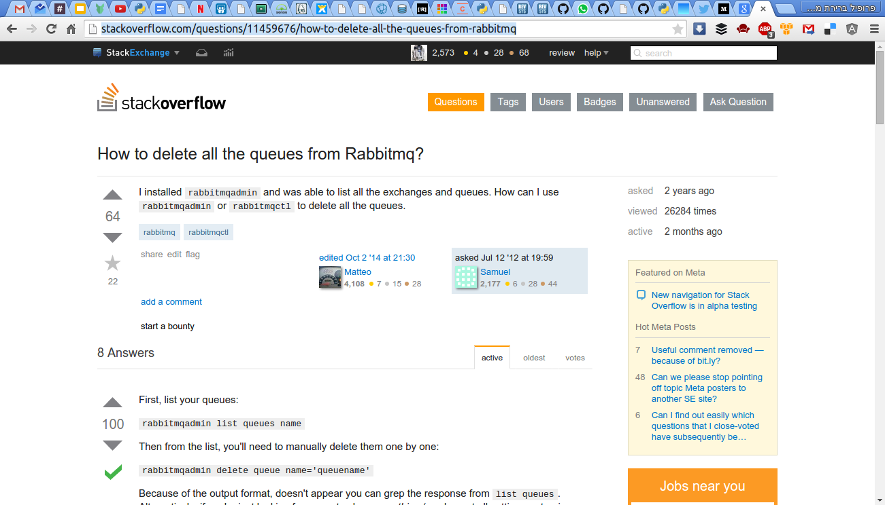

class: center, middle

# Gnu Parallel

###A gentle introduction and Some real live examples

[live presentation](http://alonisser.github.io/Introduction-bash-parallel) <br/>

[twitter](alonisser@twitter.com), [medium](https://medium.com/@alonisser/)

#####you can also read my political blog: degeladom.wordpress.com
---

# Installation

```bash

sudo apt-get install parallel

wherever: (wget -O - pi.dk/3 || curl pi.dk/3/ || fetch -o - http://pi.dk/3) | bash
```
---

# Maybe you are familiar with xargs

```bash
redis-cli KEYS "pattern:*" | xargs redis-cli DEL
```

---

# Parallel syntax

```bash
parallel echo ::: A B C
```
Would echo

```
>>A
>>B
>>C
```
---
class: center, middle

# WOW

---

## Oh, well
## That wasn't very exciting

---

class: center, middle

# Parallel: First real live example

---

##When ProcessPoolExecutor just isn’t the right tool for the job 

* When we don’t want to adapt our code. 
* When we need the full application, not running a specific function/class (concurrent.futures pool executor can be passed only pickable objects)

--

##For example: Maybe we already have a management command..

--

###A long running management command we need to parallelize.

---

## processAccounts.sh

```bash
processAccount (){
  local account=$1
  python manage.py very_long_processing_command $account>>account_output_$account.txt 2>&1
}

accounts=$(get_accounts) #Cleared for bravity..
export -f processAccount

parallel -I{} -q bash -c ‘processAccount {}’ ::: $accounts
```

---

#Limits

Our system has bounds: cpu, io, file descriptors,  memory, db connections.. etc

We can limit the parallel execution according to that:

--

* Limit the number of jobs:

```
-j 20 (up to 20 jobs)
-j 200% (up to 2 jobs per cpu core)
```
* Limit to maximum system load
 ```
--load 90%
```
* Delay 2 seconds between jobs:
```
--delay 2
```

* Many more options

---

class: center, middle

#Second example

---

#Oh no

```bash
ubuntu@demo:~$ rabbitmqadmin -f tsv -q list queues name | grep celery |wc -l 
>>62360

```

---

#Oh no

```python
@shared_task(ignore_results=True)
def run_very_frequently():
    do_something()

```


---

#Stackoverflow to the rescue

.img-container[]

---

# So I can script a solution?

```bash
rabbitmqadmin -H hostname.rabbithole -f tsv -q list queues name | 
    grep celery | while read queue;
       do rabbitmqadmin -H hostname.rabbithole -q delete queue name=${queue};
 done
 ```
 
---
 
#This is would get nasty
 
 About a second for a call
 
  
 **60,000** queues to delete
 
---

class: center

#We need bigger guns


---
 
# Parallel to the rescue!
 
 ```bash
 parallel  -j 50 rabbitmqadmin -H hostname.rabbithole -q delete queue name={} ::: 
    $(rabbitmqadmin -H hostname.rabbithole -f tsv -q list queues name | grep celery)
 ```
 
 **50** times speed up (if my computer can handle the number of processes)
 
---
 
# Many more features and options

 * Running parallel processes on remote machines (with ssh)

 * Reading input from file

 * Multiple arguments

 * Showing progress reports

 * Running interactively

---

# Caution

Concurrent computing rightfully earned some notorious reputation: Handling locks, data integrity and race conditions are just few of the the reasons. Don’t take this lightly

--

Also Parallel is CLI tool, running outside of our program, Using it without reasoning on flow, dependencies, resources, etc can be dangerous and lead to unexpected results.

---

# More info

* https://medium.com/@alonisser/parallel-straight-from-your-command-line-feb6db8b6cee (by yours truly)
* Docs: http://www.gnu.org/software/parallel/

* man parallel
* https://www.biostars.org/p/63816/ (More thorough) 

---

class: center, middle

#Open source rocks!

---

class: center, middle

#Thanks for listening!

---
